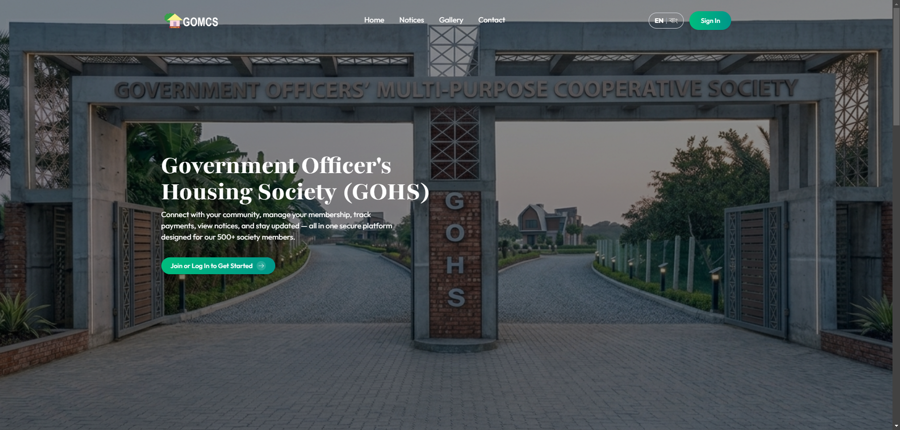
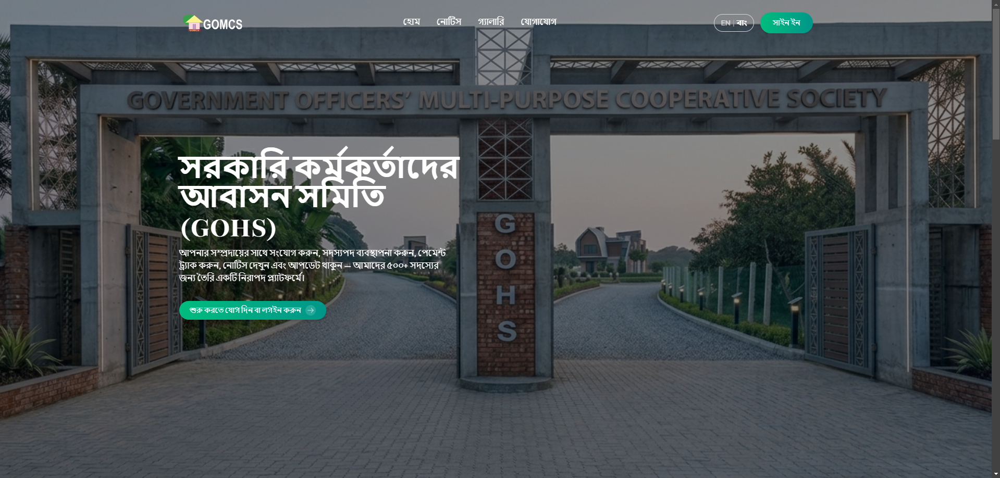
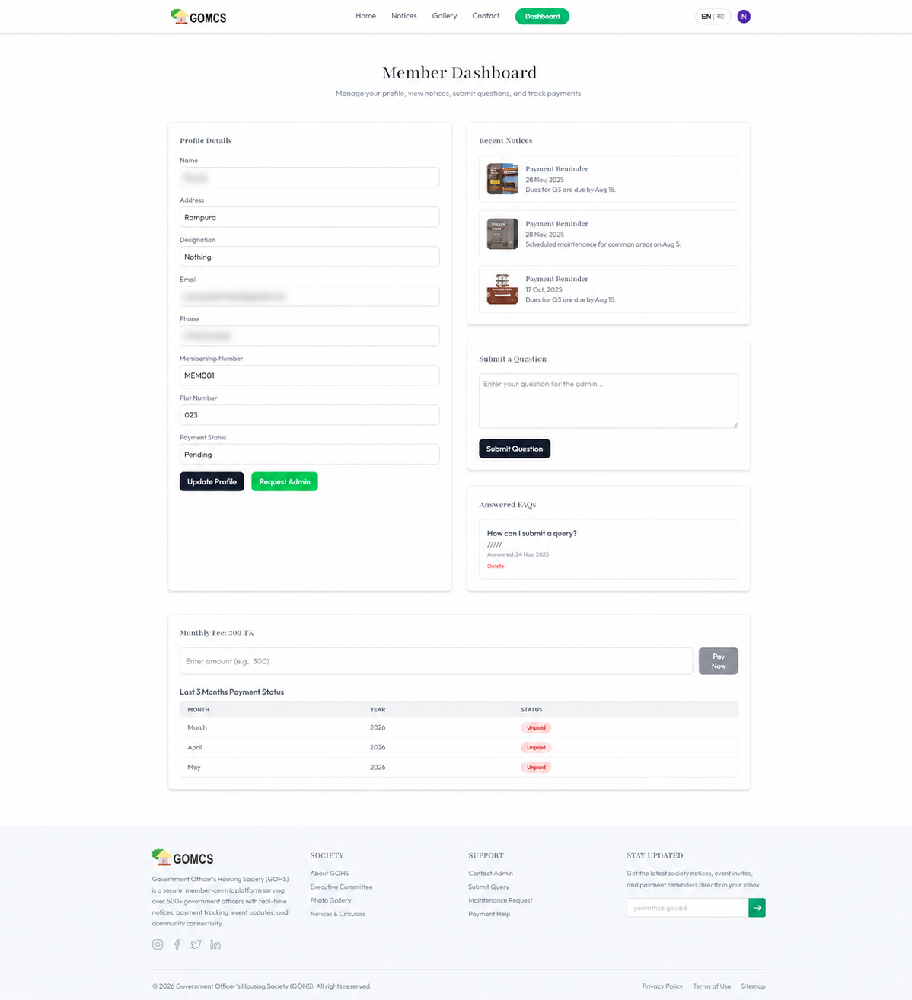
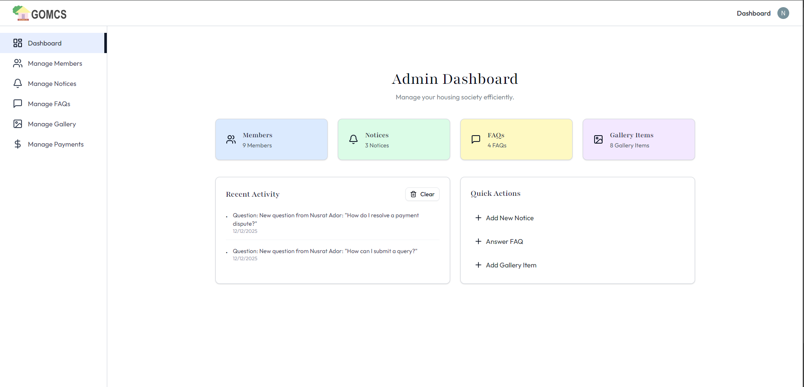
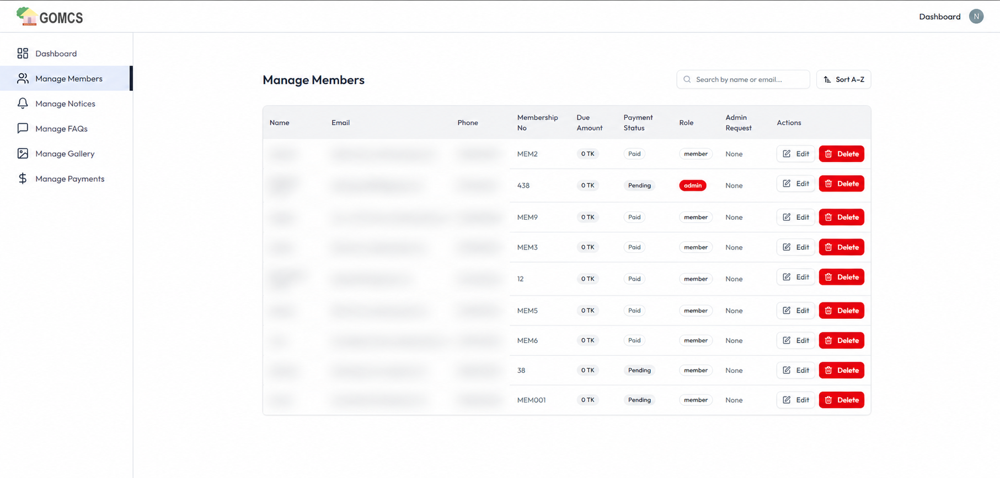
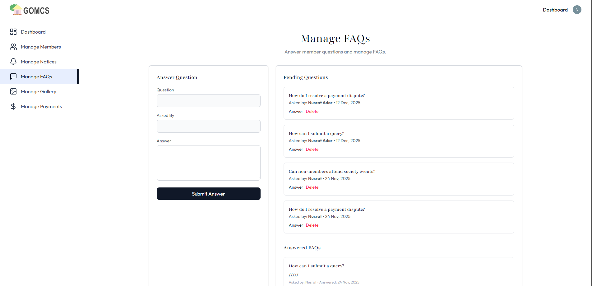

<div align="center">

# 🏘️ Housing Society Management System

<p>
A scalable full-stack housing society management platform built with the MERN stack, Clerk authentication, MongoDB, Socket.io, and Cloudinary.
</p>

<p>
  <a href="https://gomcs.vercel.app/">
    
  </a>

  <a href="https://github.com/NusratAdor/housing-society-management-system">
    
  </a>

  <a href="./LICENSE">
    
  </a>
</p>

</div>

---

## 🌐 Live Demo

🔗 **https://gomcs.vercel.app/**

---

## ✨ Features

### 👥 Member Experience
- Secure authentication using Clerk
- Member profile creation after sign-up
- Personalized member dashboard
- View payment history and payment status
- Society notices and announcements
- In-app notifications system
- FAQ and support section
- Responsive and user-friendly interface

### 🛠️ Admin Dashboard
- Manage society members
- Create, update, and delete notices
- Manage FAQ entries
- Manage gallery and uploaded images
- Review and monitor payment records
- Role-based admin controls

### 🔔 Real-Time & Security Features
- Real-time updates using Socket.io
- Protected member and admin routes
- API rate limiting for security
- Scheduled reminder jobs using node-cron
- Cloudinary image upload integration

### 📱 Modern UI/UX
- Fully responsive design
- Smooth animations and transitions
- Mobile-friendly dashboard experience
- Clean and modern UI using Tailwind CSS

---

## 🔌 Backend & API Features

- RESTful API architecture
- Modular controller-based backend structure
- Clerk authentication middleware
- Role-based access control
- MongoDB schema modeling with Mongoose
- Real-time communication with Socket.io
- Secure API middleware configuration
- Centralized backend error handling

---

## 💡 Why I Built This

I built this platform to explore how modern housing society applications manage member systems, secure authentication, real-time communication, role-based dashboards, payment tracking, and scalable MERN stack architecture.

---

## 🛠️ Tech Stack

### Frontend

| Technology | Purpose |
|---|---|
| React.js | Frontend framework |
| Vite | Fast frontend tooling |
| Tailwind CSS | Styling |
| Clerk | Authentication & user management |
| React Router DOM | Routing |
| Framer Motion | Animations |
| Axios | API requests |
| i18next | Localization |
| Socket.io Client | Real-time updates |

### Backend

| Technology | Purpose |
|---|---|
| Node.js | Backend runtime |
| Express.js | REST API server |
| MongoDB | NoSQL database |
| Mongoose | Database modeling |
| Clerk Express SDK | Authentication middleware |
| Socket.io | Real-time communication |
| Cloudinary | Image uploads |
| Nodemailer | Email notifications |
| node-cron | Scheduled jobs |
| Helmet | API security |
| express-rate-limit | Rate limiting |

### Infrastructure & Services

| Technology | Purpose |
|---|---|
| Vercel / Render | Deployment |
| MongoDB Atlas | Cloud database |
| Clerk | Authentication platform |
| Cloudinary | Media storage |
| SSLCommerz | Payment integration |

---

## 📸 Screenshots

### Homepage


### Homepage-Bangla


### Member Dashboard


### Admin Panel


### Manage Members


### FAQ


---

## ⚙️ Getting Started

### Prerequisites

- Node.js 18+
- MongoDB Atlas or local MongoDB
- Clerk account
- Cloudinary account
- SSLCommerz account (optional)

---

### 1. Clone the repository

```bash
git clone https://github.com/NusratAdor/housing-society-management-system.git
cd YOUR-REPOSITORY
```

---

### 2. Install dependencies

```bash
# Install backend dependencies
cd server
npm install

# Install frontend dependencies
cd ../client
npm install
```

---

### 3. Configure environment variables

Create a `.env` file inside the `server/` directory:

```env
PORT=5000

# Database
MONGODB_URI=

# Clerk
CLERK_PUBLISHABLE_KEY=
CLERK_SECRET_KEY=
CLERK_WEBHOOK_SECRET=

# Cloudinary
CLOUDINARY_CLOUD_NAME=
CLOUDINARY_API_KEY=
CLOUDINARY_API_SECRET=

# SSLCommerz
SSL_STORE_ID=
SSL_STORE_PASSWORD=

# Email
EMAIL_USER=
EMAIL_PASS=
```

Create a `.env` file inside the `client/` directory:

```env
VITE_CLERK_PUBLISHABLE_KEY=
VITE_API_URL=http://localhost:5000
```

---

### 4. Run the development servers

```bash
# Backend
cd server
npm run server
```

```bash
# Frontend
cd client
npm run dev
```

Application runs at:

```txt
Frontend: http://localhost:5173
Backend: http://localhost:5000
```

---

## 📁 Project Structure

```txt
housing-society-management-system/
├── client/                     # React frontend
│   ├── public/
│   ├── src/
│   │   ├── assets/             # Static assets
│   │   ├── components/         # Reusable UI components
│   │   ├── context/            # App state and auth helpers
│   │   ├── i18n/               # Localization setup
│   │   ├── pages/              # Route-level pages
│   │   ├── routes/             # Route configuration
│   │   └── utils/              # Utility functions
│   └── package.json
│
├── server/                     # Express backend
│   ├── configs/                # DB and service configuration
│   ├── controllers/            # Route handlers
│   ├── middleware/             # Auth and upload middleware
│   ├── models/                 # Mongoose schemas
│   ├── routes/                 # API routes
│   ├── services/               # Business logic helpers
│   ├── jobs/                   # Scheduled tasks
│   ├── utils/                  # Utility functions
│   └── server.js               # Backend entry point
│
├── screenshots/                # README screenshots
├── .env.example
├── README.md
└── package.json
```

---

## 🔄 Application Flow

```txt
User Authentication (Clerk)
            ↓
Create Member Profile
            ↓
Access Member Dashboard
            ↓
View Notices, Payments & Notifications

Admin Authentication
            ↓
Access Admin Panel
            ↓
Manage Members, Notices & Gallery
```

---

## 🏗️ Architecture Overview

```txt
React Frontend
      ↓
REST API (Express.js)
      ↓
MongoDB Database

Clerk Authentication
      ↓
Protected Routes & Role Access

Socket.io
      ↓
Real-time Notifications & Updates
```

---

## ☁️ Deployment

- Frontend deployed on Vercel
- Backend hosted on Render / Railway
- MongoDB database hosted on MongoDB Atlas
- Authentication handled by Clerk
- Images hosted on Cloudinary
- Payment integration powered by SSLCommerz

---

## 🚀 Future Improvements

- [ ] Online maintenance payment gateway
- [ ] Push notifications

---

## 👩‍💻 Author

**Nusrat Ador**  
📧 [nusratjahan141462@gmail.com](mailto:nusratjahan141462@gmail.com)  
🔗 GitHub: https://github.com/NusratAdor

---

## 🚀 Future Goals

This project is continuously evolving with improvements focused on real-time communication, scalable MERN architecture, secure member management, and production-grade housing society solutions.

---

## 📜 License

This project is licensed under the MIT License.
